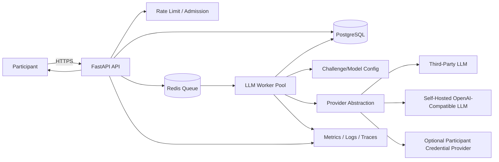
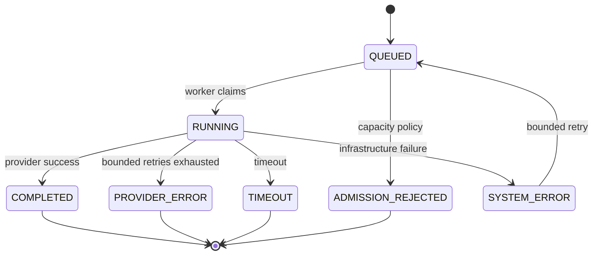

# Architecture — LLM Sandbox

## 1. Architectural Principles

1. The API never executes model calls directly when asynchronous admission is required.
2. Participant input is untrusted.
3. The challenge system prompt is secret game state.
4. The database is the source of truth for durable run state.
5. The queue is only a scheduling mechanism.
6. Provider implementations are hidden behind an interface.
7. Configuration is immutable during a run.
8. Credentials are short-lived and never persisted unless explicitly required.
9. Spend is bounded before a provider call.
10. Scale on queue age/depth and provider/resource pressure, not request count alone.

## 2. Logical Architecture



## 3. Request Path

```text
Client
  |
  v
Load Balancer
  |
  v
FastAPI
  |
  +--> authenticate
  +--> validate
  +--> rate-limit
  +--> capacity check
  +--> create run
  +--> enqueue run_id
  |
  v
202 Accepted
```

The API should not perform expensive provider calls before returning admission acknowledgement under normal queued operation.

## 4. Worker Path

```text
Redis Queue
   |
   v
Worker
   |
   +--> atomic claim RUN
   |
   +--> load immutable challenge/model config
   |
   +--> fetch ephemeral participant credential if supplied
   |
   +--> provider request
   |
   +--> bounded retry/circuit-breaker policy
   |
   +--> persist result + usage
   |
   +--> ACK queue item
   |
   +--> cleanup transient state
```

## 5. Provider Abstraction

```python
class LLMProvider(Protocol):
    async def generate(self, request: LLMRequest) -> LLMResponse:
        ...
```

Implementations:

```text
LLMProvider
├── OpenAICompatibleProvider
├── SelfHostedProvider
└── ParticipantCredentialProvider
```

The application should depend on `LLMProvider`, not on a specific vendor SDK.

## 6. Challenge Configuration

A challenge resolves to an immutable execution configuration:

```text
challenge_version
        |
        +--> system_prompt
        +--> model binding
        +--> max input tokens
        +--> max output tokens
        +--> temperature
        +--> timeout
        +--> response byte limit
```

Configuration must be versioned so a later operator edit cannot change the meaning of an already queued run.

## 7. Prompt Construction

Use a fixed trusted envelope:

```text
SYSTEM:
    challenge system prompt

USER:
    participant prompt
```

Do not build prompts using uncontrolled string concatenation across unrelated trusted sections.

The application may normalize input size and transport encoding, but should not implement hidden prompt-rewriting tricks that make the challenge itself misleading.

## 8. Prompt Injection Challenge Boundary

The model is the challenge surface.

The backend protects:
- provider credentials;
- infrastructure;
- hidden API routes;
- database internals;
- filesystem;
- internal network;
- other participants.

The backend does **not** attempt to eliminate every possible model-level prompt injection path, because prompt injection is the intended round mechanic.

## 9. Queue and Backpressure

Redis should carry:

```json
{
  "run_id": "01J...",
  "attempt": 1
}
```

Never push:
- system prompts;
- provider API keys;
- complete model transcripts;
- large request bodies.

Admission policy should consider:
- queue size;
- queue age;
- worker capacity;
- provider concurrency;
- configured cost budget.

Reject upstream with `429` or `503` when continued admission would violate operating limits.

## 10. Caching

Safe cache candidates:
- immutable challenge metadata;
- immutable challenge version metadata;
- model/provider capabilities;
- static public challenge listings.

Do not cache participant run results unless cache semantics and authorization are explicit.

Do not cache raw provider credentials.

## 11. Scaling Tiers

### Tier 1 — Recruitment/demo
- 1 API service with 2 replicas.
- 1 PostgreSQL instance.
- 1 Redis instance.
- 1–2 worker processes.
- one configured model/provider.

### Tier 2 — Event load
- horizontally scaled API replicas;
- autoscaled worker pool;
- managed PostgreSQL;
- managed Redis;
- object storage for optional transcripts;
- dedicated provider concurrency controls.

### Tier 3 — Larger platform
- per-provider queues;
- provider-specific worker pools;
- regional execution pools;
- stronger rate/budget isolation;
- read replicas for analytics;
- additional sandboxing around self-hosted inference.

Do not add Kubernetes, Kafka, service meshes or multiple databases until measurements justify them.

## 12. Reliability and Idempotency

Run state machine:



Finalization must use a conditional update so stale workers cannot overwrite a terminal result.

## 13. Cost Model

Approximate run cost is driven by:

```text
cost/run
  ≈ input_tokens × input_price
  + output_tokens × output_price
  + queue/compute overhead
  + storage/observability overhead
```

The largest lever is usually token budget and model choice. Therefore:
- cap input size;
- cap output tokens;
- discourage unnecessary retries;
- enforce admission controls;
- measure actual token distributions;
- avoid verbose telemetry.

## 14. Security Zones

```text
PUBLIC ZONE
  Load Balancer

APPLICATION ZONE
  API
  PostgreSQL
  Redis
  Observability

WORKER ZONE
  LLM workers
  Secret access

EXTERNAL PROVIDER ZONE
  Approved provider endpoints
```

Participant input crosses into the application and model layers only after validation.

## 15. Operational Rules

- Health checks must not spend money on real LLM calls.
- Readiness checks may verify dependency connectivity without generating model traffic.
- Provider failures must not crash the API process.
- One provider's outage should not create a retry storm against another.
- Secrets must be injected only into the component that needs them.
