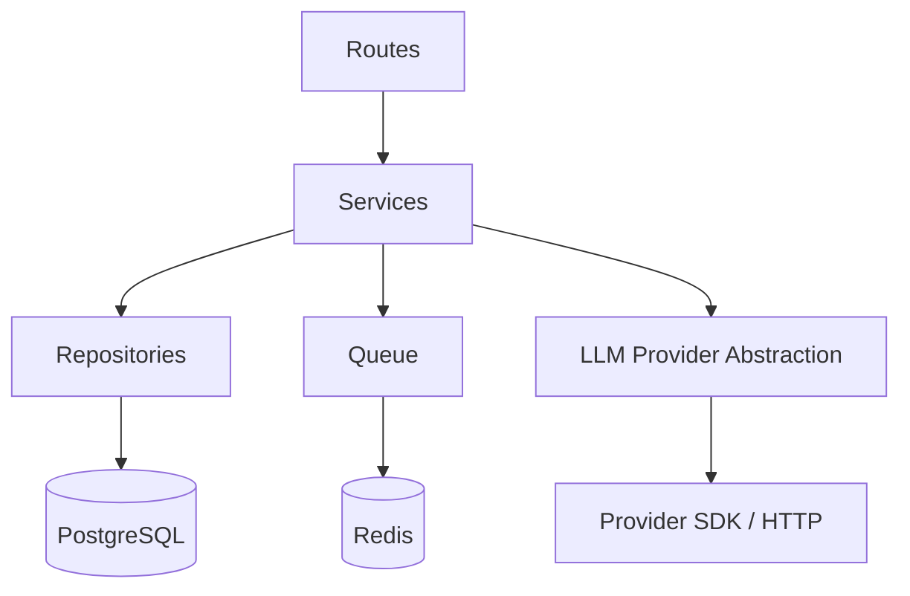

# Backend Structure — LLM Sandbox

## 1. Repository Layout

```text
llm-sandbox/
├── app/
│   ├── main.py
│   ├── api/
│   │   ├── deps.py
│   │   ├── errors.py
│   │   └── routes/
│   │       ├── runs.py
│   │       ├── challenges.py
│   │       └── health.py
│   ├── core/
│   │   ├── config.py
│   │   ├── security.py
│   │   ├── logging.py
│   │   ├── metrics.py
│   │   └── rate_limit.py
│   ├── db/
│   │   ├── session.py
│   │   ├── models/
│   │   │   ├── user.py
│   │   │   ├── provider.py
│   │   │   ├── model.py
│   │   │   ├── challenge.py
│   │   │   ├── challenge_version.py
│   │   │   └── run.py
│   │   └── repositories/
│   │       ├── runs.py
│   │       ├── challenges.py
│   │       └── models.py
│   ├── schemas/
│   │   ├── runs.py
│   │   ├── challenges.py
│   │   └── common.py
│   ├── services/
│   │   ├── run_service.py
│   │   ├── challenge_service.py
│   │   ├── admission_service.py
│   │   └── result_service.py
│   ├── queue/
│   │   ├── client.py
│   │   └── jobs.py
│   ├── llm/
│   │   ├── base.py
│   │   ├── requests.py
│   │   ├── responses.py
│   │   ├── routing.py
│   │   └── providers/
│   │       ├── openai_compatible.py
│   │       ├── self_hosted.py
│   │       └── participant_provider.py
│   └── workers/
│       ├── runner.py
│       ├── worker_pool.py
│       └── handlers.py
├── migrations/
│   └── versions/
├── tests/
│   ├── unit/
│   ├── integration/
│   ├── security/
│   ├── performance/
│   └── contract/
├── infra/
│   ├── docker/
│   │   ├── api.Dockerfile
│   │   └── worker.Dockerfile
│   ├── compose/
│   │   └── docker-compose.yml
│   └── terraform/
├── scripts/
│   ├── seed_challenge.py
│   ├── seed_models.py
│   └── healthcheck.py
├── .env.example
├── pyproject.toml
└── README.md
```

## 2. Layering



Rules:
- routes handle HTTP only;
- services implement business rules;
- repositories own persistence;
- provider classes own vendor-specific behavior;
- workers orchestrate jobs;
- provider secrets never cross into repositories or API responses.

## 3. API Rules

Example:

```python
@router.post("/v1/runs", status_code=202)
async def create_run(
    payload: RunCreate,
    service: RunService = Depends(),
):
    return await service.enqueue_run(payload)
```

The route must not:
- call the model;
- build raw provider payloads;
- read secrets;
- start background threads ad hoc;
- perform N queries to construct one response.

## 4. Run Service

Responsibilities:
- validate challenge availability;
- validate prompt length;
- enforce admission controls;
- create the run row;
- enqueue the run ID;
- return the public run identifier.

Target admission operation:
```text
1 short DB transaction (run row + transactional outbox)
1 queue enqueue / outbox publisher
1 HTTP response
```

Outbox & Reconciler:
- Run record is committed atomically with the queued state.
- In-memory/background outbox publisher or queue reconciler guarantees that committed `QUEUED` runs with missing queue jobs are recovered without duplication.

## 5. Worker

A worker should:
1. receive `run_id`;
2. atomically claim `QUEUED -> RUNNING`;
3. load execution context;
4. load any short-lived credential;
5. invoke the provider;
6. apply bounded retry policy;
7. write the result;
8. acknowledge the queue item;
9. cleanup transient secrets/state.

## 6. Query Efficiency

Rules:
- one pooled DB connection per task;
- short transactions;
- explicit eager loading;
- no lazy loading in loops;
- no per-message DB lookup if multiple queued jobs can be processed in a bounded batch;
- select only required columns;
- bulk insert/update where multiple rows are required;
- test query counts in integration tests.

Example anti-pattern:

```python
for run in runs:
    await repo.get_challenge(run.challenge_id)
```

Preferred:
```sql
SELECT ...
FROM runs
JOIN challenge_versions ...
JOIN model_bindings ...
WHERE runs.id = :run_id;
```

## 7. Pagination

For participant run history use keyset pagination:

```sql
SELECT id, status, created_at
FROM runs
WHERE user_id = :user_id
  AND (created_at, id) < (:cursor_time, :cursor_id)
ORDER BY created_at DESC, id DESC
LIMIT 50;
```

Avoid deep `OFFSET` pagination for large histories.

## 8. Connection Pooling

Use bounded pools.

Example starting point:
```text
pool_size = 10
max_overflow = 5
pool_timeout_s = 2
```

The real connection budget must account for all API and worker replicas.

## 9. LLM Request Guardrails

Every provider request must receive a normalized request object:

```python
@dataclass(frozen=True)
class LLMRequest:
    system_prompt: str
    user_prompt: str
    model: str
    max_output_tokens: int
    temperature: float
    timeout_ms: int
```

Validate:
- maximum prompt length;
- supported model;
- maximum output tokens;
- allowed temperature range;
- timeout range;
- provider route.

Never allow participant input to set arbitrary HTTP headers or provider URLs.

## 10. Provider Retry Policy

Use:
- bounded exponential backoff;
- jitter;
- maximum attempt count;
- circuit breaker;
- retry classification.

Never retry everything.

A `400` or invalid request is not a transient failure.

## 11. Response Handling

Provider response must be normalized into:

```python
@dataclass(frozen=True)
class LLMResponse:
    text: str
    input_tokens: int | None
    output_tokens: int | None
    model: str
    provider_request_id: str | None
    finish_reason: str | None
```

Responses must be bounded before persistence or HTTP serialization.

## 12. Logging

Structured JSON fields:
```text
timestamp
level
service
request_id
run_id
user_id_hash
provider
model
latency_ms
status
error_class
```

Never log:
- system prompt;
- participant API keys;
- provider Authorization headers;
- full raw request payload by default;
- unrestricted raw model response.

## 13. Testing

### Unit
- admission policy;
- token/size limits;
- state transitions;
- provider error mapping;
- retry classification;
- output bounding.

### Integration
- API + PostgreSQL + Redis;
- worker + fake provider;
- worker + real provider in an isolated test environment;
- idempotent finalization;
- pagination;
- query-count assertions.

### Security
- credential leakage;
- system prompt leakage through errors;
- cross-user run access;
- oversized request;
- arbitrary provider URL injection;
- log redaction.

### Performance
- API p95;
- queue wait p95;
- provider latency p95/p99;
- runs/sec;
- DB utilization;
- Redis utilization;
- cost per 1,000 runs.

## 14. Recommended Stack

| Layer | Choice |
|---|---|
| API | FastAPI + Pydantic |
| Server | Uvicorn |
| DB | PostgreSQL |
| ORM | SQLAlchemy 2.x |
| Migrations | Alembic |
| Queue/Rate limiting | Redis |
| HTTP client | httpx |
| Provider abstraction | internal protocol + adapters |
| Metrics | Prometheus-compatible |
| Tests | pytest |
| Packaging | pyproject.toml |

Keep vendor SDK usage behind adapters.
