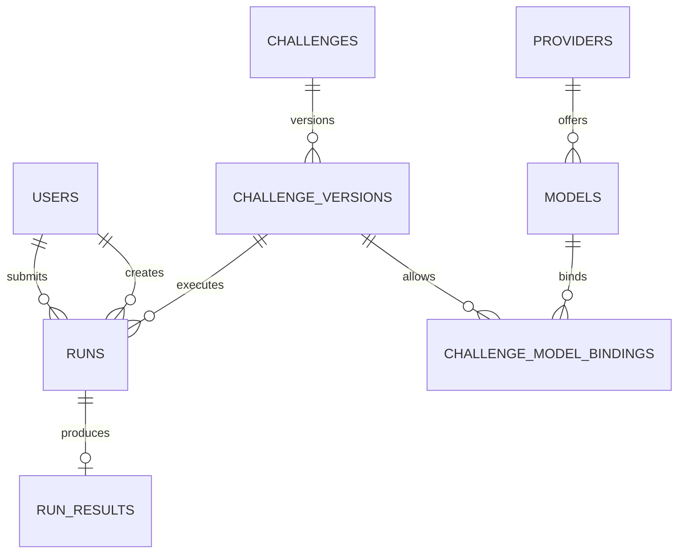

# Database Structure — LLM Sandbox (BCNF)

## 1. Design Goals

The durable schema is designed to satisfy **Boyce-Codd Normal Form (BCNF)** while keeping the hot path efficient.

The database stores:
- participants;
- providers and models;
- challenge identity/version metadata;
- model bindings;
- durable run state;
- compact usage/results.

Large optional transcripts should use object storage when retention or size requirements make that preferable.

## 2. Entities



## 3. Tables

### `users`

```text
id               PK
external_ref     UNIQUE
display_name
created_at
```

Candidate keys:
- `id`
- `external_ref`

### `providers`

```text
id               PK
code             UNIQUE
kind
active
```

Candidate keys:
- `id`
- `code`

### `models`

```text
id               PK
provider_id      FK
model_name
active
created_at
```

Candidate keys:
- `id`
- `(provider_id, model_name)`

### `challenges`

```text
id               PK
slug             UNIQUE
title
status
created_at
```

Candidate keys:
- `id`
- `slug`

### `challenge_versions`

```text
id                    PK
challenge_id          FK
version_no
system_prompt_ciphertext
system_prompt_hash
created_at
published_at
```

Candidate keys:
- `id`
- `(challenge_id, version_no)`

### `challenge_model_bindings`

```text
challenge_version_id  PK, FK
model_id              PK, FK
max_input_tokens
max_output_tokens
temperature
timeout_ms
active
```

Candidate key:
- `(challenge_version_id, model_id)`

All configuration facts depend on the full key.

### `runs`

```text
id                    PK
user_id               FK
challenge_version_id  FK
model_id              FK
status
prompt_hash
prompt_bytes
attempt_count
created_at
started_at
finished_at
```

### `run_results`

```text
run_id                PK, FK
response_object_key
response_preview
input_tokens
output_tokens
duration_ms
finish_reason
provider_request_id
created_at
```

## 4. BCNF Reasoning

### Functional dependencies

Examples:

```text
users:
id -> external_ref, display_name, created_at
external_ref -> id, display_name, created_at
```

Both determinants are candidate keys.

```text
providers:
id -> code, kind, active
code -> id, kind, active
```

Both determinants are candidate keys.

```text
models:
id -> provider_id, model_name, active, created_at
(provider_id, model_name) -> id, active, created_at
```

Both determinants are candidate keys.

```text
challenge_versions:
id -> challenge_id, version_no, ...
(challenge_id, version_no) -> id, ...
```

Both determinants are candidate keys.

```text
challenge_model_bindings:
(challenge_version_id, model_id)
    -> max_input_tokens, max_output_tokens,
       temperature, timeout_ms, active
```

The composite determinant is the primary key.

Because every non-trivial determinant is a candidate key/superkey of its relation, the core relations satisfy BCNF.

## 5. PostgreSQL DDL

```sql
CREATE TABLE users (
    id UUID PRIMARY KEY DEFAULT gen_random_uuid(),
    external_ref VARCHAR(128) NOT NULL UNIQUE,
    display_name VARCHAR(120) NOT NULL,
    created_at TIMESTAMPTZ NOT NULL DEFAULT NOW()
);

CREATE TABLE providers (
    id SMALLSERIAL PRIMARY KEY,
    code VARCHAR(32) NOT NULL UNIQUE,
    kind VARCHAR(32) NOT NULL,
    active BOOLEAN NOT NULL DEFAULT TRUE
);

CREATE TABLE models (
    id BIGSERIAL PRIMARY KEY,
    provider_id SMALLINT NOT NULL REFERENCES providers(id),
    model_name VARCHAR(128) NOT NULL,
    active BOOLEAN NOT NULL DEFAULT TRUE,
    created_at TIMESTAMPTZ NOT NULL DEFAULT NOW(),
    UNIQUE (provider_id, model_name)
);

CREATE TABLE challenges (
    id BIGSERIAL PRIMARY KEY,
    slug VARCHAR(80) NOT NULL UNIQUE,
    title VARCHAR(200) NOT NULL,
    status VARCHAR(20) NOT NULL,
    created_at TIMESTAMPTZ NOT NULL DEFAULT NOW(),
    CHECK (status IN ('DRAFT', 'LIVE', 'DISABLED', 'ARCHIVED'))
);

CREATE TABLE challenge_versions (
    id BIGSERIAL PRIMARY KEY,
    challenge_id BIGINT NOT NULL REFERENCES challenges(id),
    version_no INTEGER NOT NULL,
    system_prompt_ciphertext TEXT NOT NULL,
    system_prompt_hash CHAR(64) NOT NULL,
    created_at TIMESTAMPTZ NOT NULL DEFAULT NOW(),
    published_at TIMESTAMPTZ,
    UNIQUE (challenge_id, version_no)
);

CREATE TABLE challenge_model_bindings (
    challenge_version_id BIGINT NOT NULL
        REFERENCES challenge_versions(id) ON DELETE CASCADE,
    model_id BIGINT NOT NULL
        REFERENCES models(id),
    max_input_tokens INTEGER NOT NULL,
    max_output_tokens INTEGER NOT NULL,
    temperature NUMERIC(4,3) NOT NULL,
    timeout_ms INTEGER NOT NULL,
    active BOOLEAN NOT NULL DEFAULT TRUE,
    PRIMARY KEY (challenge_version_id, model_id),
    CHECK (max_input_tokens > 0),
    CHECK (max_output_tokens > 0),
    CHECK (temperature >= 0),
    CHECK (timeout_ms > 0)
);

CREATE TABLE runs (
    id UUID PRIMARY KEY DEFAULT gen_random_uuid(),
    user_id UUID NOT NULL REFERENCES users(id),
    model_binding_id BIGINT NOT NULL
        REFERENCES challenge_model_bindings(id),
    status VARCHAR(24) NOT NULL,
    prompt_hash CHAR(64) NOT NULL,
    prompt_bytes INTEGER NOT NULL,
    attempt_count INTEGER NOT NULL DEFAULT 0,
    created_at TIMESTAMPTZ NOT NULL DEFAULT NOW(),
    started_at TIMESTAMPTZ,
    finished_at TIMESTAMPTZ,
    CHECK (status IN (
        'QUEUED',
        'RUNNING',
        'COMPLETED',
        'PROVIDER_ERROR',
        'TIMEOUT',
        'RATE_LIMITED',
        'VALIDATION_ERROR',
        'ADMISSION_REJECTED',
        'SYSTEM_ERROR'
    )),
    CHECK (prompt_bytes >= 0),
    CHECK (attempt_count >= 0)
);

CREATE TABLE run_results (
    run_id UUID PRIMARY KEY
        REFERENCES runs(id) ON DELETE CASCADE,
    response_object_key VARCHAR(512),
    response_preview TEXT,
    input_tokens INTEGER,
    output_tokens INTEGER,
    duration_ms INTEGER,
    finish_reason VARCHAR(64),
    provider_request_id VARCHAR(255),
    created_at TIMESTAMPTZ NOT NULL DEFAULT NOW()
);
```

## 6. Integrity Rule for `runs`

Application code ensures the selected model is allowed by the challenge version via the surrogate binding ID:

```text
challenge_model_bindings.id PK
runs.model_binding_id FK
```

This turns the allowed-model relationship into a direct foreign key constraint.

## 7. Recommended Production Variant

Use:

```text
challenge_model_bindings
------------------------
id                    PK
challenge_version_id  FK
model_id              FK
max_input_tokens
max_output_tokens
temperature
timeout_ms
active
UNIQUE(challenge_version_id, model_id)
```

Then:

```text
runs
----
model_binding_id FK
```

This keeps the database normalized and strengthens referential integrity.

## 8. Indexing

Only create indexes justified by real query patterns.

```sql
CREATE INDEX idx_runs_user_created_id
    ON runs (user_id, created_at DESC, id DESC);

CREATE INDEX idx_runs_status_created
    ON runs (status, created_at)
    WHERE status IN ('QUEUED', 'RUNNING');

CREATE INDEX idx_challenge_versions_challenge
    ON challenge_versions (challenge_id, version_no DESC);

CREATE INDEX idx_models_provider_active
    ON models (provider_id, active);
```

Do not create indexes for every column. Each extra index increases write cost and storage.

## 9. Pagination

Use keyset pagination:

```sql
SELECT id, status, created_at
FROM runs
WHERE user_id = :user_id
  AND (created_at, id) < (:cursor_time, :cursor_id)
ORDER BY created_at DESC, id DESC
LIMIT 50;
```

Matching index:

```sql
CREATE INDEX idx_runs_user_created_id
    ON runs (user_id, created_at DESC, id DESC);
```

Avoid:

```sql
OFFSET 100000
LIMIT 50;
```

## 10. Hot Queries

### Status

```sql
SELECT
    r.id,
    r.status,
    r.created_at,
    rr.response_preview,
    rr.input_tokens,
    rr.output_tokens,
    rr.duration_ms
FROM runs r
LEFT JOIN run_results rr
    ON rr.run_id = r.id
WHERE r.id = :run_id;
```

One primary-key-driven read plus a one-to-one join.

### Worker context

Use one bounded query:

```sql
SELECT
    r.id,
    r.user_id,
    r.prompt_hash,
    r.prompt_bytes,
    r.attempt_count,
    cv.system_prompt_ciphertext,
    cmb.max_input_tokens,
    cmb.max_output_tokens,
    cmb.temperature,
    cmb.timeout_ms,
    m.model_name,
    p.code AS provider_code
FROM runs r
JOIN challenge_model_bindings cmb
    ON cmb.id = r.model_binding_id
JOIN challenge_versions cv
    ON cv.id = cmb.challenge_version_id
JOIN models m
    ON m.id = cmb.model_id
JOIN providers p
    ON p.id = m.provider_id
WHERE r.id = :run_id;
```

The actual production variant should use `model_binding_id` as noted above.

## 11. N+1 Prevention

Never:

```text
load N runs
for each run:
    load challenge
    load model
    load provider
```

Use bounded joins or explicit batch retrieval.

Test query count in integration tests.

Example:

```python
with assert_query_count(max_queries=3):
    await run_service.get_history(user_id, cursor)
```

## 12. Retention

Suggested event policy:
- run metadata: 30–90 days;
- compact usage/results: 30–90 days;
- full response transcript: 1–30 days if required;
- verbose logs: 1–7 days.

The exact retention must be configurable.

## 13. Sensitive Data

Prefer hashes and object references over storing full participant prompts/responses in hot relational tables.

The system prompt must be encrypted at rest.

Never expose `system_prompt_ciphertext` or decrypted system prompt through public APIs.

## 14. Verification

For important queries:

```sql
EXPLAIN (ANALYZE, BUFFERS)
SELECT id, status, created_at
FROM runs
WHERE user_id = :user_id
ORDER BY created_at DESC, id DESC
LIMIT 50;
```

Check:
- index usage;
- row estimates;
- actual rows;
- buffer reads;
- execution time.

## 15. Migration Rules

Use Alembic:

```text
001_initial_schema
002_constraints
003_indexes
004_run_result_storage
005_binding_fk_hardening
```

Never manually modify production schema outside migrations.
